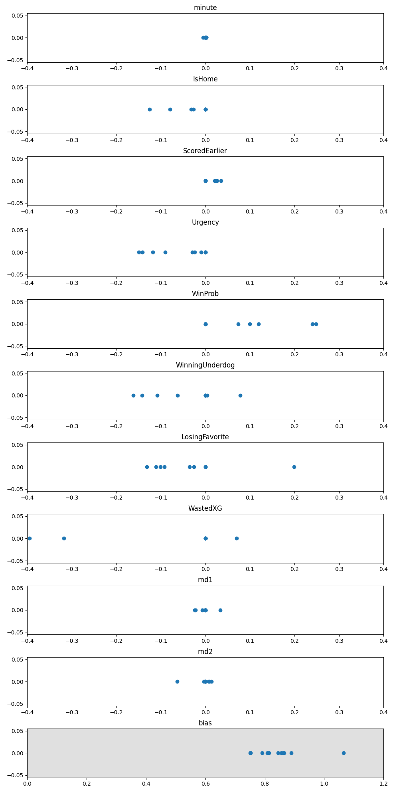

# Goalscorer confidence

Does confidence matter for converting chances into goals in football? Can machine learning help?

xG is a popular metric in football analysis. It measures how likely it is that a specific shot results in a goal. However, mental factors are rarely taken into account. Therefore, a new metric - **AwareXG** - was devised in this analysis, to investigate how pressure and self-belief impact chance conversion.

The analysis is done using Pandas and sklearn.

## Introduction

xG is calculated from the location of the shot-taker, the goalkeeper's position, the speed of the ball, and other physical features, and mathematically it is the expected value of the number of goals scored from the shot-taking situation. 

Common classification models are of **no use** in this problem. Goalscoring is impossible to predict, and accurate prediction is what most ML models are made to do. Additionally, xG is already present in the data, which should be used since it already gives a great estimate for the chance that a goal will be scored. Most xG values are under 0.3, so any combination of positive mental attributes is still unlikely to result in a goal, because of the paucity of high-xG chances.

## Methods

At first, I wanted to see if scoring a goal earlier in the match meant that a player would score more efficiently. I counted the total xG and total goals realized after already scoring a goal - however, I got the contrary result. I realized that other correlated variables were probably at fault. Therefore, I needed to do proper feature extraction with an ML model.

The statistical model used is described by the equation:

$$ \text{AwareXG} = \text{xG} * \text{1 + b + a_0 x_0 + a_1 x_1 + ...} $$

where $x_i$ are the features, and $a_i$ and $b$ are the model parameters.

With careful feature engineering, this model makes the usage of linear regression favorable with one caveat. Instead of predicting the values 0 if a goal isn't scored and 1 if it is, the model is trained on predicting *scaled goals*, which are calculated as $1/ \text{xG}$. Therefore, even though the model is incapable of accurate prediction of goals, the least-squares method can give us accurate $\alpha_i$ coefficients.

A variety of feature combinations was used. Normal Linear regression and ElasticNet were the models used. Two random features, rnd1 and rnd2 were inserted for control. 

The autoregressive property is preserved (through great effort). 

## Results

## Further work

Data from other leagues can be added easily. In addition, I suspect that many individual player features (like PrevAccumXG) are used by the model as proxies for the player's usual goalscoring ability or position, but I wasn't able to quantify this easily while preserving the autoregressive property - this can be done in the future.